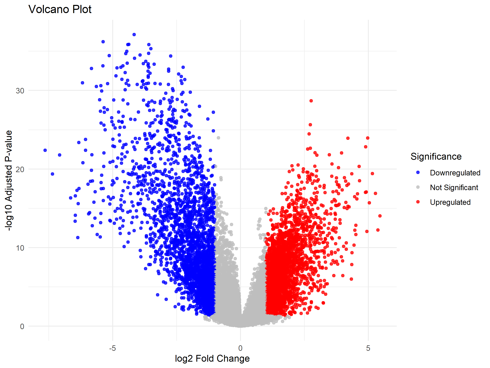
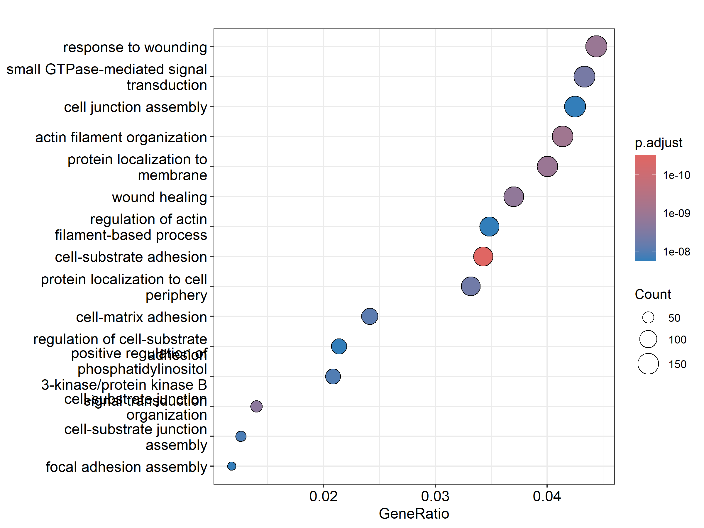
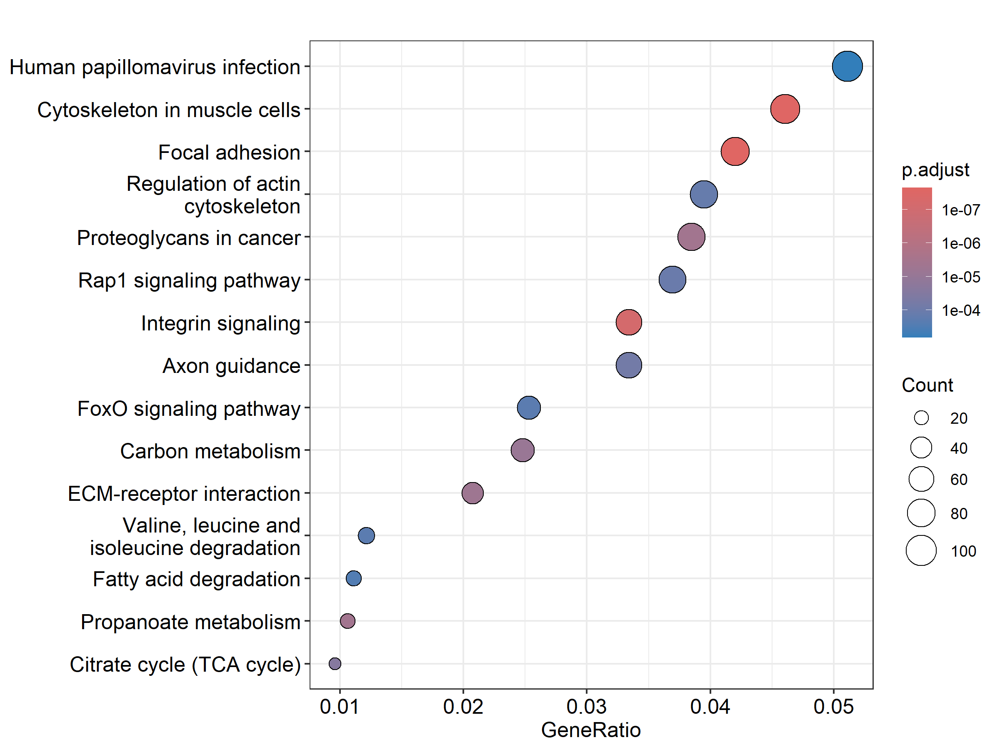
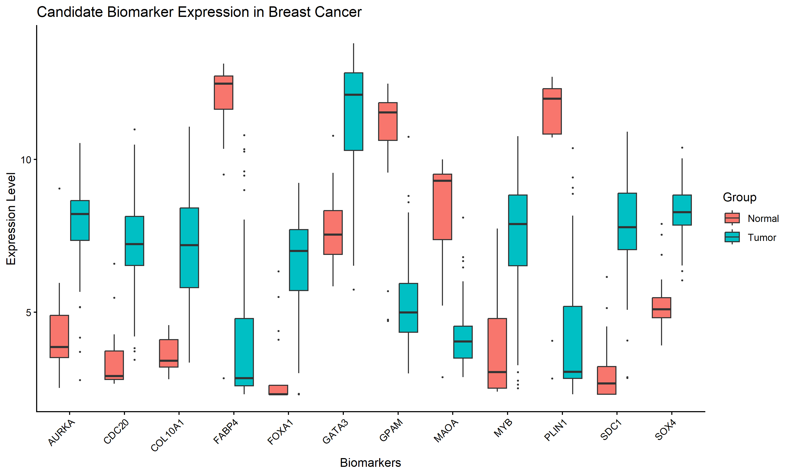

---

# 🧬 Transcriptomic Biomarker Discovery in Breast Cancer

## Overview

This project performs an integrated bioinformatics analysis to identify potential breast cancer biomarkers using gene expression data.

The workflow combines differential expression analysis, functional enrichment, protein interaction networks, and survival analysis to prioritize clinically relevant biomarker candidates.

---

## Dataset

**GEO Accession:** GSE42568
**Organism:** Homo sapiens

Dataset:

* 54,675 genes
* 121 breast tissue samples

Analysis was performed using R and Bioconductor packages.

---

## Workflow

```
GEO Dataset
     ↓
Differential Expression Analysis (limma)
     ↓
GO & KEGG Enrichment
     ↓
PPI Network Analysis (STRING)
     ↓
Survival Analysis
     ↓
Final Biomarker Candidates
```

---

## Methods

### Differential Expression Analysis

Tool: **limma**

Criteria:

```
Adjusted P-value < 0.05
|log2FC| > 1
```

Results:

| Category      | Genes |
| ------------- | ----: |
| Upregulated   |  2731 |
| Downregulated |  2970 |

<p align="center">

</p>
---

## Functional Enrichment

### GO Analysis

Top biological processes:

* Cell-substrate adhesion
* Actin filament organization
* Cell-matrix adhesion
* PI3K-AKT signaling regulation

<p align="center">

</p>


### KEGG Pathways

Top pathways:

* Focal adhesion
* Integrin signaling
* ECM-receptor interaction
* Proteoglycans in cancer

---

<p align="center">

</p>

## Biomarker Identification

Candidates were selected using:

✔ Differential expression
✔ PPI network connectivity
✔ Survival association

Final biomarkers:

| Gene  | Degree | Cox P-value |
| ----- | -----: | ----------: |
| CDC20 |      7 |    6.33e-06 |
| AURKA |      8 |    6.09e-04 |
| FOXA1 |      4 |    4.97e-04 |
| GATA3 |      4 |    2.80e-03 |
| SOX4  |      2 |    5.14e-03 |


<p align="center">

</p>


---

## Repository Structure

```
├── main.R
├── scripts/
├── results/
│   ├── figures/
│   └── tables/
├── README.md
└── .gitignore
```

---

## Running the Pipeline

```r
source("main.R")
```

All results will be generated in the `results/` directory.

---

## Future Improvements

* Machine learning based biomarker prediction
* ROC validation
* External dataset validation
* Multi-omics integration

---
